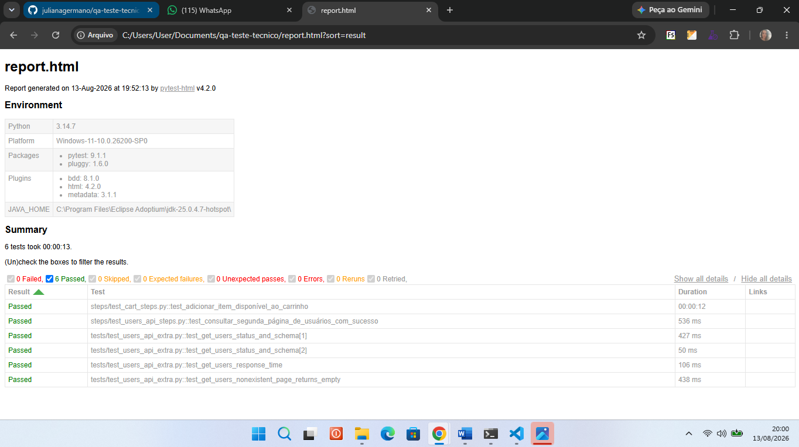

# QA Teste Técnico — Automação (API + Web)

Suíte de testes automatizados cobrindo a API pública reqres.in e o fluxo de carrinho da aplicação SauceDemo, usando Playwright + pytest-bdd.

## Pré-requisitos

- Python 3.10+
- Conta gratuita em https://app.reqres.in para gerar uma API key própria

## Relatório de execução



O relatório completo também é gerado automaticamente a cada execução do
pipeline e fica disponível como artefato na aba **Actions** do repositório.

## Como rodar localmente

1. Clone o repositório:
   \`\`\`bash
   git clone https://github.com/SEU-USUARIO/qa-teste-tecnico.git
   cd qa-teste-tecnico
   \`\`\`

2. Crie e ative o ambiente virtual:
   \`\`\`bash
   python -m venv venv
   venv\Scripts\activate
   \`\`\`

3. Instale as dependências:
   \`\`\`bash
   pip install -r requirements.txt
   playwright install chromium
   \`\`\`

4. Crie um arquivo \`.env\` na raiz com sua própria API key do reqres.in:
   \`\`\`
   REQRES_API_KEY=sua_chave_aqui
   \`\`\`

5. Rode os testes:
   \`\`\`bash
   pytest -v
   \`\`\`

6. (Opcional) Gere o relatório em HTML:
   \`\`\`bash
   pytest --html=report.html --self-contained-html
   \`\`\`

   ## Estrutura do projeto

```
qa-teste-tecnico/
├── features/           # Cenários em Gherkin (.feature)
│   ├── users_api.feature
│   └── cart.feature
├── steps/               # Step definitions (pytest-bdd)
│   ├── test_users_api_steps.py
│   └── test_cart_steps.py
├── tests/               # Testes complementares (parametrização, schema, tempo de resposta)
│   └── test_users_api_extra.py
├── pages/                # Page Objects (Web)
│   ├── login_page.py
│   └── inventory_page.py
├── schemas/              # JSON Schemas para validação de contrato
│   └── users_schema.py
├── conftest.py           # Fixtures compartilhadas (browser, contexto da API)
├── requirements.txt
├── .env                  # Não versionado — contém a API key (ver Pré-requisitos)
└── .github/workflows/ci.yml
```

## Decisões técnicas

- **Playwright**: escolhido por permitir testar API e Web na mesma stack, reduzindo duplicação de setup e curva de aprendizado — e por ser a ferramenta mais demandada nas vagas que tenho buscado atualmente.
- **pytest-bdd**: mantém os cenários em Gherkin (legíveis por não-técnicos) enquanto aproveita todo o ecossistema pytest (fixtures, parametrização,   relatórios).
- **JSON Schema**: validação de contrato da resposta da API, não só dos valores — garante que mudanças estruturais quebrem o teste antes de quebrar em produção.
- **Waits explícitos**: uso exclusivamente o auto-wait nativo do Playwright (`expect().to_have_text()`), sem `sleep()` fixo, para evitar flakiness.
- **Teste de tempo de resposta**: 3 amostras com mediana, em vez de uma única medição, para reduzir falsos negativos por variação de rede em API pública.
- **API key via `.env`**: durante o desenvolvimento, identifiquei que a
reqres.in migrou de uma API totalmente pública para um modelo com projetos e chaves de autenticação (`x-api-key`). Optei por armazenar a chave em variável de ambiente, fora do código-fonte, seguindo boas práticas de segurança — cada pessoa que rodar o projeto deve gerar sua própria chave gratuita em app.reqres.in.

  ## Limitações

- Cobertura de API focada no endpoint solicitado (`GET /users`); não cobre demais endpoints do reqres.in.
- Fluxo Web cobre apenas o caminho feliz (login → adicionar → validar carrinho); casos negativos (login inválido, item indisponível) não estão automatizados nesta entrega, mas estão listados na análise manual (ver Parte C).
- Relatório usa pytest-html; Allure não foi configurado nesta entrega,
mas a estrutura de testes já é compatível com adoção futura.
- Testes de API dependem de uma API key gratuita gerada individualmente
(ver Pré-requisitos), já que a reqres.in deixou de ser totalmente pública.

  ## Parte A — Análise Manual: GET /users?page=2

### Cenários de teste

**Positivos**
- Retorna status 200 com página válida (page=2)
- Retorna exatamente 6 usuários (per_page padrão)
- Cada usuário contém id, email, first_name, last_name, avatar
- Campos de paginação (page, per_page, total, total_pages) coerentes entre si

**Negativos**
- page=0 ou negativo (comportamento inesperado deve ser identificado)
- page como texto não numérico (page=abc)
- Parâmetro extra desconhecido não deve quebrar a resposta

**Bordas**
- page=1 (primeira página)
- page=último total_pages (última página válida)
- page=999 (além do limite — retorna array vazio, não erro)
- Requisição sem parâmetro page (deve assumir default = 1)

### Validações na resposta

- **Contrato**: schema válido (tipos e campos obrigatórios presentes)
- **Dados**: e-mail em formato válido, IDs numéricos, avatar como URL
- **Paginação**: total_pages compatível com total e per_page
- **Performance**: tempo de resposta dentro de um limite aceitável,
  medido com múltiplas amostras para evitar flakiness

### Estratégia de automação

Prioridade: contrato (schema) e status code primeiro, pois são o que
quebra silenciosamente quando a API muda — o maior risco de um bug
passar despercebido até produção. Paginação e performance vêm em
seguida, por serem mais estáveis e menos propensas a mudança sem aviso.

## Parte C — Casos de Teste: Adicionar Produto ao Carrinho

User Story: Como um usuário autenticado, eu quero adicionar um produto ao carrinho, para que eu possa finalizar a compra depois.

| # | Caso de teste | Tipo | Automatizar? | Por quê |
|---|---|---|---|---|
| 1 | Adicionar produto disponível → aparece no carrinho | Positivo | Sim | Fluxo crítico (AC1) |
| 2 | Adicionar 2 produtos diferentes → quantidade = 2 | Positivo | Sim | Regra de negócio central (AC2) |
| 3 | Item exibido com nome e preço corretos | Positivo | Sim | Risco financeiro/dados (AC3) |
| 4 | Remover item → carrinho fica vazio | Positivo | Sim | Fluxo crítico (AC4) |
| 5 | Adicionar produto indisponível/esgotado | Negativo | Sim | Risco de negócio alto |
| 6 | Adicionar o mesmo produto duas vezes | Borda | Sim | Regra de negócio ambígua, alto risco se quebrar |
| 7 | Tentar adicionar sem estar autenticado | Negativo | Sim | Risco de segurança |
| 8 | Remover item que não está no carrinho | Borda | Não | Baixo risco, baixa frequência |
| 9 | Carrinho vazio exibe mensagem apropriada | Borda | Não | Baixa criticidade |
| 10 | Preço no carrinho bate com o catálogo | Borda | Sim | Risco financeiro direto |

**Critério de priorização**: automatizei os casos de alto risco financeiro, segurança e alta frequência de regressão. Deixei manuais os casos de baixa criticidade, que têm custo de automação maior que o risco que mitigam.

## Parte B — Cenários BDD (Gherkin)

### API — GET /users?page=2

```gherkin
# language: pt
Funcionalidade: Listagem de usuários via API

  Cenário: Consultar segunda página de usuários com sucesso
    Dado que a API reqres.in está disponível
    Quando eu solicito a lista de usuários na página 2
    Então o status da resposta deve ser 200
    E a resposta deve conter exatamente 6 usuários
    E cada usuário deve conter os campos obrigatórios
    E o campo "page" da resposta deve ser igual a 2
```

### Web — Adicionar item ao carrinho (SauceDemo)

```gherkin
# language: pt
Funcionalidade: Adicionar produto ao carrinho

  Cenário: Adicionar item disponível ao carrinho
    Dado que o usuário está logado no SauceDemo
    Quando ele adiciona a "Sauce Labs Backpack" ao carrinho
    Então o ícone do carrinho deve mostrar 1 item
    E o item "Sauce Labs Backpack" deve aparecer no carrinho com nome e preço corretos
```

**Sobre Examples/Scenario Outline**: não utilizei nesta entrega porque cada cenário representa um fluxo único e específico (uma consulta de página fixa, um produto fixo). Scenario Outline seria justificado se eu precisasse repetir o mesmo comportamento variando múltiplos produtos ou múltiplas páginas — o que fica registrado como possível evolução futura da suíte.

## Como eu pensei

Priorizei validar o contrato (schema) antes do conteúdo, porque é o que
pega quebras estruturais que testes de valor isolado não pegam — mesma
lógica que aplico hoje mantendo mais de 1.800 cenários BDD sincronizados em ambiente regulado (BACEN).

Escolhi uma stack única (Playwright) para API e Web, em vez de dividir
entre ferramentas diferentes, para reduzir fragmentação e curva de
manutenção — princípio que já apliquei migrando validações de mainframe
para web em projeto anterior.

Durante o desenvolvimento, identifiquei que a reqres.in migrou de uma API totalmente pública para um modelo com autenticação por chave. Em vez de travar nesse ponto, tratei como qualquer mudança de contrato em produção: investiguei, adaptei a estratégia (variável de ambiente, chave individual por quem for rodar o projeto) e documentei a decisão — o mesmo raciocínio que aplico no dia a dia frente a mudanças inesperadas de API.

Mantive os cenários BDD enxutos, com foco em comportamento observável
(o que o usuário ou o consumidor da API vê), não em passos de implementação.

**Trade-offs conscientes**: não automatizei casos negativos do fluxo Web (login inválido, item indisponível) nesta entrega — ficaram documentados na análise manual (Parte C) por serem, no momento, de menor criticidade frente ao tempo disponível. Também não configurei Allure, optando por pytest-html, por ser suficiente para o escopo desta entrega.


[def]: docs/report-screenshot.png